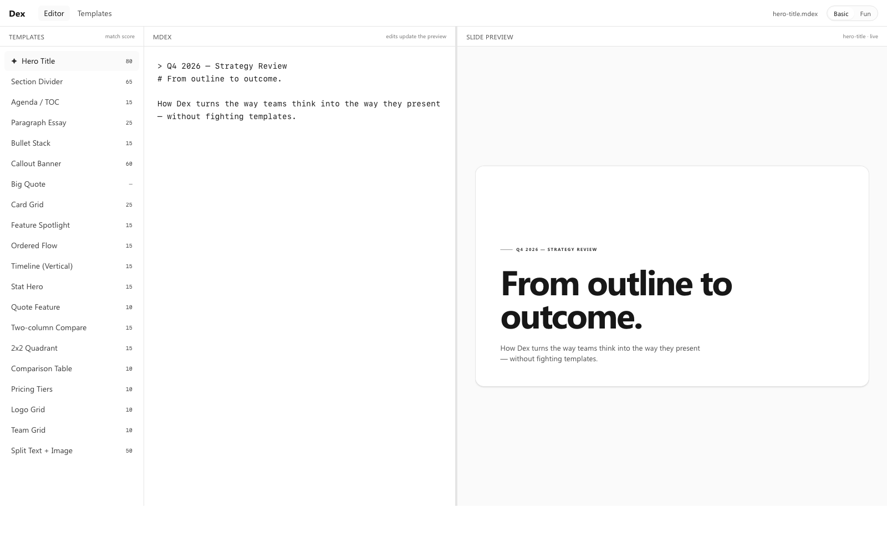
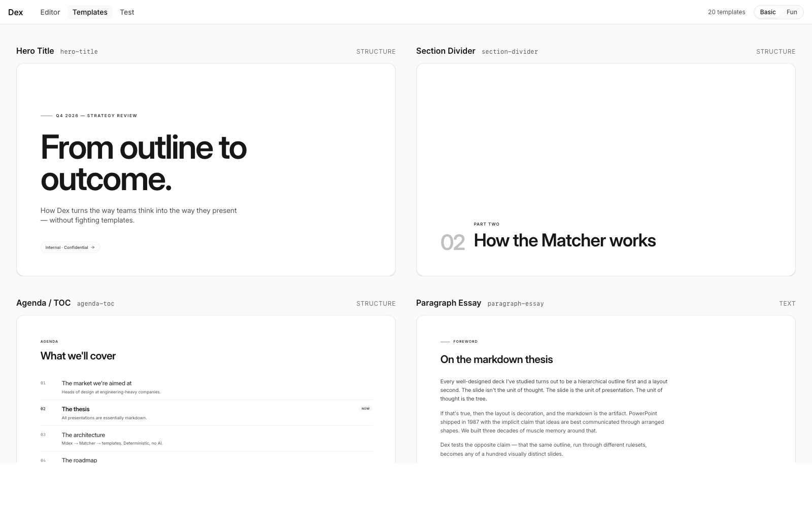
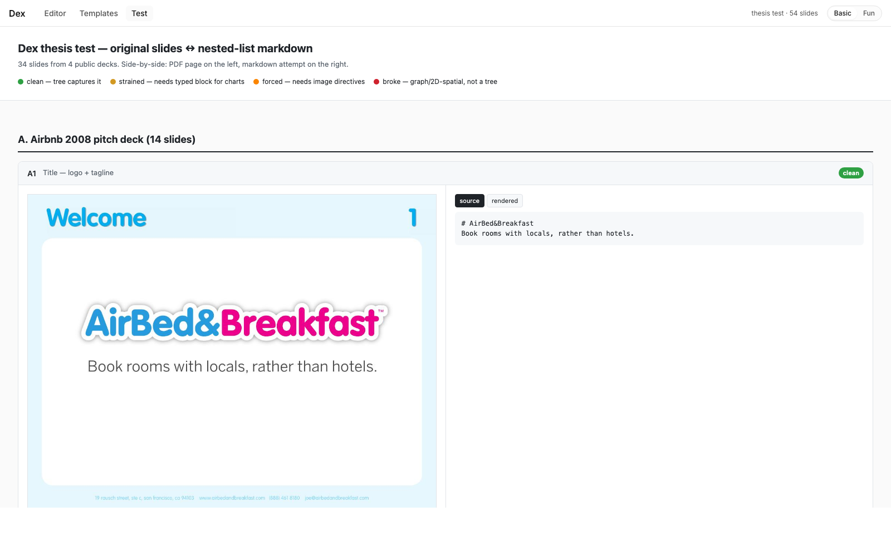

# Dex

A headless presentation tool. Markdown in, slides out.

**Editor** — mdex on the left, rendered slide on the right, ranked template matches in the sidebar.



**Template gallery** — every template rendered with its canonical sample so you can scan the library at a glance.



**Test bench** — 54 real-world and synthetic slides side-by-side with their nested-list mdex, color-coded by fit (clean / strained / forced / broke). The thesis test that motivated the architecture.



## Thesis

All presentations are essentially markdown. The slide isn't the unit of thought — the *tree* is. The same outline, run through different rulesets, becomes any of a hundred visually distinct slides.

Dex tests that claim by treating mdex (a markdown superset) as the source of truth, parsing it into a structured `SlideShape`, and ranking 20 hand-built TSX templates against it deterministically — no AI, no embeddings.

## What's here

This repo is the v0 prototype. End-to-end pipeline:

```
mdex text → tokens → SlideShape → adapter → template props → ScaledSlide
                          ↓
                    Matcher (rule-based scorer) → ranked candidates
```

- **20 TSX templates** in `src/templates/` — pure layout shells, each with a co-located canonical sample. Categories: structure, text, data, comparison, people, media.
- **Mdex pipeline**: parser (`src/mdex/parse.ts`) walks `marked.lexer()` tokens into a `SlideShape`. Per-template adapter (`src/mdex/adapt.ts`) maps the shape to props. The editor re-renders on every keystroke.
- **Matcher** (`src/mdex/matcher.ts`): rule-based scorers, one per template. Each returns 0–100 based on how well the shape fits. The sidebar surfaces every template's score and stars (✦) the top match.
- **Round-trip click**: clicking any element in the slide preview jumps the cursor to the matching line in the mdex source.
- **Fixed-size slides + ScaledSlide**: every slide renders at native 1280×720 and is visually scaled (`transform: scale`) to fit whatever space the user gives the preview pane.
- **Resizable split** between mdex and preview, persisted to localStorage.
- **Two flavors**: `Basic` (Genesis neutral palette + Inter) and `Fun` (orange + Plus Jakarta Sans + heavier display weights). Toggle in the header. Implemented as a `data-flavor="fun"` attribute on `<html>` that overrides the brand palette and font tokens — no per-template changes.

## Stack

- React 19, TypeScript 5.9 strict
- Vite 8, Tailwind CSS v4.2 with semantic design tokens
- React Aria Components for primitives
- `marked` for the lexer
- Plus Jakarta Sans + Inter via Google Fonts

## Setup

```bash
npm install
npm run dev
```

Opens on `http://localhost:5173`. Routes:

- `/` — editor: sidebar template picker, resizable mdex pane, live slide preview
- `/templates` — gallery of all 20 templates rendered with their canonical samples
- `/test` — thesis test bench: 54 slides (34 scraped from real public decks + 20 synthetic shapes) shown side-by-side with their nested-list markdown

## Project structure

```
src/
├── templates/
│   ├── _primitives/         # Slide, ScaledSlide, Kicker, Title, Subtitle, Body, Chip
│   ├── <id>/index.tsx       # 20 templates
│   └── index.ts             # registry: id, name, category, component, canonical
├── mdex/
│   ├── types.ts             # SlideShape interface
│   ├── parse.ts             # marked lexer → SlideShape
│   ├── adapt.ts             # 20 per-template adapters
│   └── matcher.ts           # rule-based scorers, matchAll/bestMatch
├── pages/
│   ├── home-screen.tsx      # editor with sidebar + split mdex/preview
│   └── template-gallery.tsx
├── components/
│   ├── nav/header.tsx       # router nav + Basic/Fun flavor toggle
│   └── split-pane/          # pointer-driven resizable split
├── providers/
│   └── flavor-provider.tsx  # basic | fun, persisted to localStorage
└── styles/
    ├── globals.css
    ├── theme.css            # Genesis tokens (neutral)
    ├── flavors.css          # [data-flavor="fun"] overrides
    └── typography.css
```

Plus `experiment-decks/` — the 32-slide thesis test (real public PDFs + 20 synthetic shapes) that motivated the architecture. See `experiment-decks/RESULTS.md` and `experiment-decks/comparison.html`.

## Vocabulary

- **mdex** — Dex's markdown superset (currently plain markdown; future: directives for components, charts, etc.)
- **f100** — the curated 100-template library this becomes (currently 20)
- **b100** — the curated benchmark corpus used to score rulesets
- **ruleset** — versioned bundle of paginator + Matcher + extensions
- **flex param** — per-template flexibility lever (zoom, hide-decoration, etc.) — used by the Matcher to score "fit" as `Fit (X of N)`
- **canonical.mdex** — the proof-of-validity input every template ships with

## Status

v0. The pipeline works end-to-end. Not yet shipped:

- Notion-like block editor (currently a textarea)
- Persisted presentations (currently in-memory, single deck)
- Flex params threaded through the Matcher score
- Image directives in mdex (`![bg]`, `![hero]`)
- Detach / reattach for free-form layouts
- Theme tokens beyond Basic + Fun
- The full f100; the curated b100; ruleset comparison
- Full source-position tracking (round-trip click is heuristic for now)

## License

TBD.
